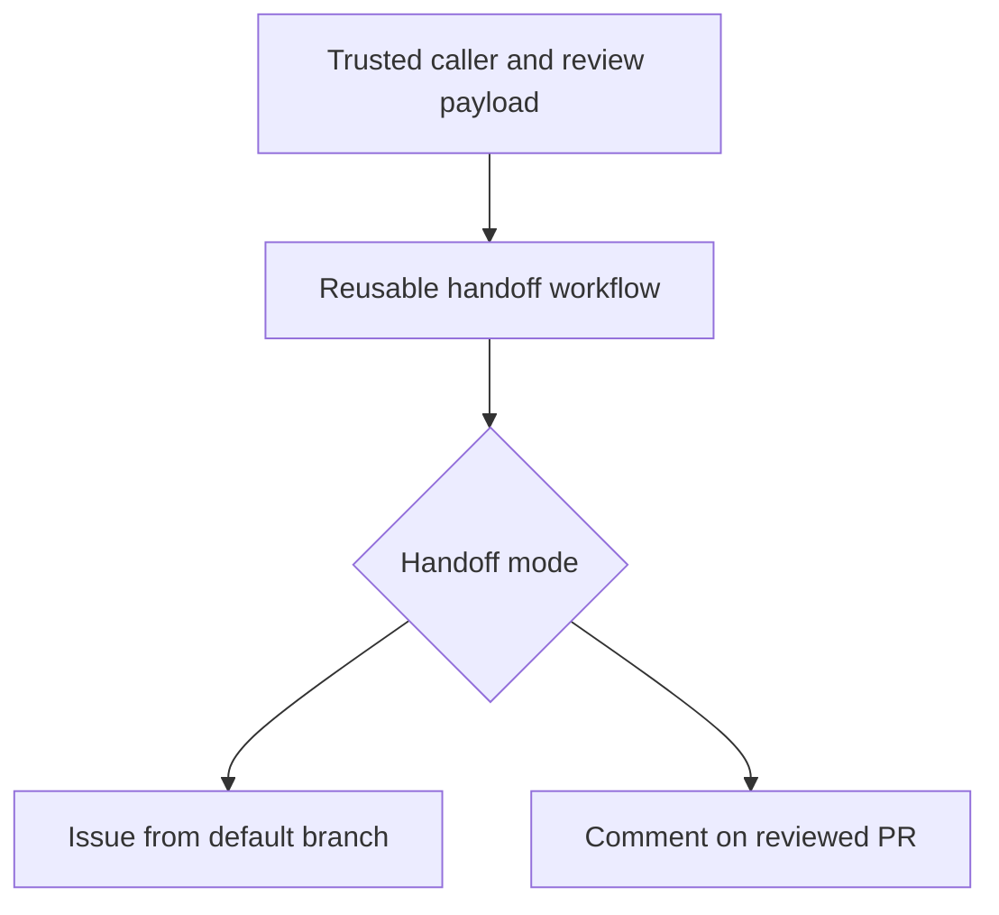

# shared-copilot-orchestrator

[](https://github.com/DownAtTheBottomOfTheMoleHole)
[](https://github.com/DownAtTheBottomOfTheMoleHole/shared-copilot-orchestrator/actions/workflows/quality.yml)
[](https://github.com/DownAtTheBottomOfTheMoleHole/shared-copilot-orchestrator/actions/workflows/release.yml)
[](https://github.com/DownAtTheBottomOfTheMoleHole/shared-copilot-orchestrator/releases)
[](./LICENSE)
[](https://github.com/features/copilot)
[](./.github/SECURITY.md)

Reusable GitHub Actions workflow for turning Copilot code review findings into
an issue or a request to fix the reviewed pull request.

## Architecture



## What this workflow does

- Accepts PR metadata and review payload via `workflow_call`.
- Uses inline comments from a submitted review as findings; Copilot's overview
  text is not treated as a finding.
- Sanitizes untrusted review text with `scripts/parse-review.js`.
- In `pull_request_comment` mode, checks that the reviewed commit is still the
  head of an open, same-repository PR, then posts an `@copilot` request on that
  PR. This mode is opt-in; verify it with a caller integration test.
- Creates a GitHub Issue in the caller repository only when actionable findings
  exist in the default `issue` mode. An identical set of findings on the same PR commit reuses an existing
  issue on a best-effort basis: the workflow reads the newest 100 issues directly
  and uses GitHub search for older issues, whose indexing may lag.
- Assigns a new or reused issue to Copilot when actionable findings are parsed
  and the issue is open with Copilot not already an assignee. A transient
  assignment failure can therefore be retried without creating another issue;
  closed matches are left closed. Set `assign_copilot: false` to create the
  issue only.
- Runs the parser from the same commit as the called workflow version, with explicit least-privilege permissions.
- Displays up to 50 actionable findings per handoff, reports the number omitted,
  and includes all actionable findings in the deduplication fingerprint.

## Releases

Releases are versioned with GitVersion after a successful **Quality** run for
the current `main` commit. The release workflow checks that exact commit, runs
the tests again, calculates the version from [`GitVersion.yml`](GitVersion.yml),
and creates a `vMAJOR.MINOR.PATCH` tag with notes generated from
[`.github/release.yml`](.github/release.yml). Superseded Quality runs do not
publish a release. Conventional commit messages drive the increment:

| Commit | Release |
| --- | --- |
| `type!:` or a `BREAKING CHANGE:` footer | major |
| `feat` | minor |
| `fix`, `perf`, `security` | patch |
| `docs`, `style`, `test`, `build`, `ci`, `chore`, `refactor`, `revert` without a breaking footer | none |

A merge that contains only non-releasing commits does not publish a new release.
Release-note categories depend on PR labels; maintainers should apply the
appropriate label before merging. See [CONTRIBUTING.md](CONTRIBUTING.md#versioning-fallbacks)
for version fallbacks.

## Development

Run the parser tests locally with Node.js 22 or newer (CI uses Node.js 24):

```sh
node --test tests/*.test.js
```

Pull requests are checked for Conventional Commit subjects and linted with MegaLinter (actionlint, ESLint, markdownlint and yamllint). Keep commits atomic: each commit should represent one focused, independently understandable change. CI checks conventional formatting; reviewers assess whether commits are atomic. See [CONTRIBUTING.md](CONTRIBUTING.md) for the contribution and release conventions.

## Usage

Follow the [secure caller example](docs/secure-caller.md), which separates the
unprivileged review event from the token-bearing handoff and validates the
review against GitHub before invoking this workflow. Pin the reusable workflow
to a reviewed release's **full commit SHA**. Do not pass a user token directly
from a `pull_request_review` workflow: a same-repository PR can modify that
workflow before it runs.

Choose `handoff_mode: pull_request_comment` to request changes on the reviewed
PR branch. The default `issue` mode creates a separate task; assigning that
issue starts Copilot from the repository's default branch, so it is not a way
to patch unmerged PR code.

### Inputs and outputs

| Name | Kind | Description |
| --- | --- | --- |
| `target_repository` | input, required | `owner/repo` for the issue; must equal the caller repository. |
| `target_pr_number` | input, required | Pull request number the findings relate to. |
| `target_sha` | input, required | Commit SHA the findings relate to; in PR-comment mode it must still be the PR head. |
| `review_payload` | input, optional | JSON review payload: a review object (only its inline comments are used as findings), a findings array, or `{ "findings": [...] }`. |
| `assign_copilot` | input, optional | Assign Copilot in issue mode; must be `true` in PR-comment mode. Defaults to `true`. |
| `handoff_mode` | input, optional | `issue` (default) or `pull_request_comment`. |
| `target_repo_token` | secret, required | Token used to create and assign the issue (see below). |
| `issue_url` | output | URL of the created or reused issue; empty in PR-comment mode or when no findings exist. |
| `pr_comment_url` | output | URL of the created or reused PR comment; empty in issue mode or when no comment was posted. |
| `actionable_count` | output | Number of actionable findings parsed. |
| `copilot_assigned` | output | `'true'` when Copilot is assigned to the issue; not a signal that a PR-comment request started a session. |

Direct finding payloads accept `path`, `line`, `severity`, and `body` (or
`comment`). Blank bodies are discarded before the 50-finding display limit.
Each field is truncated for issue rendering; the workflow reports additional
findings omitted from display. A review-object payload fetches inline comments
using the caller's user token.

For a caller that already has structured findings, a payload can look like:

```json
{"findings":[{"path":"src/example.js","line":12,"severity":"high","body":"Handle the missing value."}]}
```

### Token requirements

Copilot cloud agent starts work when an issue is assigned to it; mentioning `@copilot` in an issue body does not start a session. Assigning Copilot requires a **user** token. `GITHUB_TOKEN` and GitHub App installation tokens cannot assign Copilot.

- For issue assignment, use a short-lived fine-grained personal access token
  scoped to the caller repository with the **actions**, **contents**, **issues**
  and **pull requests** permissions required by Copilot cloud agent. Avoid a
  broad classic `repo` token when a fine-grained token works.
- The token owner must have a Copilot plan with Copilot cloud agent access, and Copilot cloud agent must be enabled for the repository.
- Store it as a repository or organisation secret, for example `COPILOT_ORCHESTRATOR_TOKEN`.
- The trusted caller's validation job needs `actions: read` and
  `pull-requests: read` on `GITHUB_TOKEN` to verify the event artifact.

If issue assignment fails, the issue is still created and the run reports a
warning. For issue creation without assignment, set `assign_copilot: false`;
the user token needs **issues: write**, **pull requests: read** (for review
comments in private repositories), and **metadata: read**. PR-comment mode needs a user
token for the comment; test that the user has write access and that Copilot
responds before enabling automatic requests. Creating the PR comment requires
either **pull requests: write** or **issues: write** on a fine-grained token.

## Security posture

- The reusable workflow requests `contents: read` for `GITHUB_TOKEN`; review
  comment reads and writes use the caller-supplied user token.
- Issues can only be created in the caller repository, even if the supplied token can reach other repositories.
- Untrusted review text is escaped for issue/comment formatting, and outputs use
  random heredoc delimiters. Escaping does **not** neutralize natural-language
  instructions to the agent; require human review and checks for agent changes.
- All actions are pinned to full commit SHAs.
- Security disclosures are handled privately per [SECURITY.md](./.github/SECURITY.md).

## License

This project is licensed under the [MIT License](./LICENSE).
