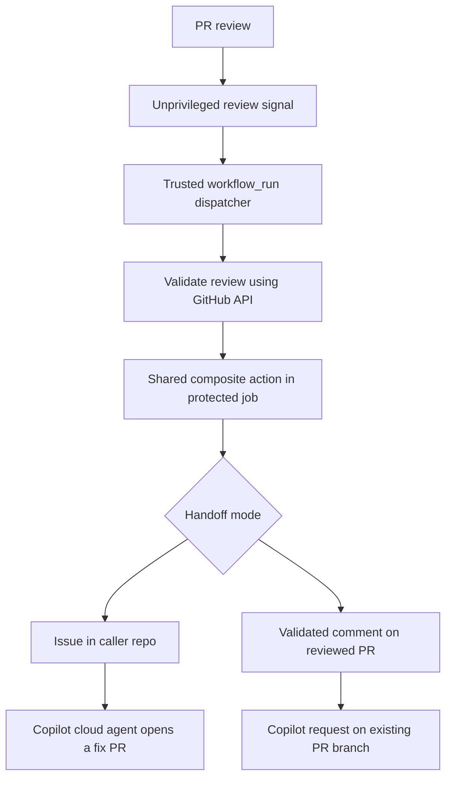

# shared-copilot-orchestrator

[](https://github.com/DownAtTheBottomOfTheMoleHole)
[](https://github.com/DownAtTheBottomOfTheMoleHole/shared-copilot-orchestrator/actions/workflows/quality.yml)
[](https://github.com/DownAtTheBottomOfTheMoleHole/shared-copilot-orchestrator/actions/workflows/release.yml)
[](https://github.com/DownAtTheBottomOfTheMoleHole/shared-copilot-orchestrator/releases)
[](./LICENSE)
[](https://github.com/features/copilot)
[](./.github/SECURITY.md)

SHA-pinned GitHub composite action for converting Copilot code review findings into actionable issues or requesting fixes directly on the reviewed pull request branch.

## Architecture



## What this action does

- Accepts validated PR metadata and a review payload as composite-action inputs.
- Uses inline comments from a submitted review as findings; Copilot's overview
  text is not treated as a finding.
- Sanitizes untrusted review text with `scripts/parse-review.js`.
- Filters non-actionable entries before the 50-finding display limit, reports
  omitted findings, and includes every actionable finding in the deduplication
  fingerprint. Large collected reviews are parsed from a file rather than an
  environment variable.
- In opt-in `pull_request_comment` mode, validates that the pull request is
  still open, same-repository, and at the reviewed SHA immediately before
  posting an `@copilot` fix request on that branch.
- Creates a GitHub Issue in the caller repository only when actionable findings
  exist. An identical set of findings on the same PR commit reuses an existing
  issue on a best-effort basis: the action reads the newest 100 issues directly
  and uses GitHub search for older issues, whose indexing may lag.
- Assigns a new or reused issue to Copilot when actionable findings are parsed
  and the issue is open with Copilot not already an assignee. A transient
  assignment failure can therefore be retried without creating another issue;
  closed matches are left closed. Set `assign_copilot: false` to create the
  issue only.
- Runs the parser from the same pinned commit as the action, without checking out caller or PR code.

## Releases

Releases are versioned with GitVersion only after a successful push-to-`main` **Quality** run. The release workflow checks out the exact Quality-tested SHA, confirms it is still live `main`, runs the tests again, and calculates the version from [`GitVersion.yml`](GitVersion.yml). Immediately before publication it revalidates `main`; an existing version tag is accepted only when its peeled commit equals the tested SHA. Superseded runs and stale tags therefore fail closed. It also refuses to publish a version older than the latest tag. Conventional commit messages drive the increment:

| Commit | Release |
| --- | --- |
| `type!:` or a `BREAKING CHANGE:` footer | major |
| `feat` | minor |
| `fix`, `perf`, `security` | patch |
| `docs`, `style`, `test`, `build`, `ci`, `chore`, `refactor`, `revert` without a breaking footer | none |

A merge that contains only non-releasing commits does not publish a new release. See [CONTRIBUTING.md](CONTRIBUTING.md#versioning-fallbacks) for the version fallbacks and manual overrides.

## Development

Run the parser tests locally with Node.js 22 or newer (CI uses Node.js 24):

```sh
node --test tests/*.test.js
```

Pull requests are checked for Conventional Commit subjects and linted with MegaLinter (actionlint, ESLint, markdownlint and yamllint). Keep commits atomic: each commit should represent one focused, independently understandable change. CI checks conventional formatting; reviewers assess whether commits are atomic. See [CONTRIBUTING.md](CONTRIBUTING.md) for the contribution and release conventions.

## Caller setup

A [`pull_request_review` workflow](https://docs.github.com/en/actions/reference/workflows-and-actions/events-that-trigger-workflows#pull_request_review) runs from the PR merge ref. For a same-repository PR, its proposed workflow changes can run when a review is submitted. **The direct reusable-workflow example in the immutable `v1.1.1` release is unsafe with a repository or organisation PAT.** Remove that caller; do not pass a PAT to any `pull_request_review` job.

Use two caller workflows:

1. **Review signal:** On `pull_request_review: submitted`, run with `permissions: {}`, no secrets and no checkout. Upload a small artifact named `copilot-review-signal` containing the numeric review ID and PR number, either as plain numeric files or numeric JSON fields. Treat either format as untrusted data.
2. **Trusted handoff:** On [`workflow_run` completion](https://docs.github.com/en/actions/reference/workflows-and-actions/events-that-trigger-workflows#workflow_run) of the signal workflow, run from the default branch. Fetch the artifact from that exact run and validate its size and numeric fields. Use the read-only `GITHUB_TOKEN` to fetch the PR and review from GitHub's API. Confirm the Copilot reviewer identity, PR and review linkage, same-repository head, run identity and timing. Derive `target_sha` from the API review's `commit_id`, then run this SHA-pinned composite action as a step in a normal job with `environment: copilot-orchestrator`. Pass a minimal review payload containing the validated review ID and pass the environment secret as `with.target_repo_token`; the action fetches inline comments itself. Do not check out or execute PR code or artifact content in the privileged run.

After a trusted `verify` job has produced the review details, its downstream job calls the action as a step:

```yaml
handoff:
  needs: verify
  if: needs.verify.outputs.valid == 'true'
  runs-on: ubuntu-latest
  environment: copilot-orchestrator
  permissions:
    contents: read
  steps:
    - uses: DownAtTheBottomOfTheMoleHole/shared-copilot-orchestrator@FULL_COMMIT_SHA
      with:
        target_repository: ${{ github.repository }}
        target_pr_number: ${{ needs.verify.outputs.pr_number }}
        target_sha: ${{ needs.verify.outputs.review_commit_id }}
        review_payload: ${{ needs.verify.outputs.review_payload }}
        handoff_mode: pull_request_comment
        assign_copilot: 'true'
        target_repo_token: ${{ secrets.COPILOT_ORCHESTRATOR_ENV_TOKEN }}
```

Pin the composite action to a reviewed full commit SHA for an immutable handoff; prefer a released commit. The example assumes the `verify` job emits the named outputs; use the linked callers for the full verification flow.

Before enabling the handoff, create an environment named `copilot-orchestrator` in the **caller** repository. Restrict deployment branches and tags to `main` under **Selected branches and tags**, and place `COPILOT_ORCHESTRATOR_ENV_TOKEN` in that environment. GitHub can create an unrestricted environment automatically when a workflow names one that does not exist, so configure the branch restriction first. Remove any previous repository or organisation secret used for this handoff. The trusted caller job must declare `environment: copilot-orchestrator` and pass `COPILOT_ORCHESTRATOR_ENV_TOKEN` as the action's `target_repo_token` input. Do not use a reusable-workflow caller job or a repository or organisation secret for this token.

The legacy `.github/workflows/copilot-orchestrator.yml` reusable workflow is disabled. It returns a skipped summary and never uses a passed token or creates an issue. Move existing direct callers to the composite action before configuring the environment token.

### Inputs and outputs

| Name | Kind | Description |
| --- | --- | --- |
| `target_repository` | input, required | `owner/repo` for the issue; must equal the caller repository. |
| `target_pr_number` | input, required | Pull request number the findings relate to. |
| `target_sha` | input, required | Commit SHA the findings relate to. |
| `review_payload` | input, optional | JSON review payload: a review object (only its inline comments are used as findings), a findings array, or `{ "findings": [...] }`. |
| `assign_copilot` | input, optional | Assign the issue to Copilot in issue mode; must be `true` in PR-comment mode. Defaults to `true`. |
| `handoff_mode` | input, optional | `issue` (default) or `pull_request_comment`. |
| `target_repo_token` | input, optional | PAT from the caller job’s protected environment; absent token skips cleanly. |
| `COPILOT_ORCHESTRATOR_ENV_TOKEN` | caller environment secret | Pass as `target_repo_token` from the protected caller job. |
| `issue_url` | output | URL of the created or reused issue; empty in PR-comment mode or when no actionable findings were parsed. |
| `pr_comment_url` | output | URL of the created or reused PR comment; empty in issue mode or when no comment was posted. |
| `actionable_count` | output | Number of actionable findings parsed. |
| `copilot_assigned` | output | `'true'` when Copilot is assigned to the created or reused issue. |

### Token requirements

Copilot cloud agent starts work when an issue is assigned to it; mentioning `@copilot` in an issue body does not start a session. Assigning Copilot requires a **user** token. `GITHUB_TOKEN` and GitHub App installation tokens cannot assign Copilot.

- Use a fine-grained personal access token scoped to the caller repository with read and write access to **actions**, **contents**, **issues** and **pull requests** (or a classic token with `repo`).
- The token owner must have a Copilot plan with Copilot cloud agent access, and Copilot cloud agent must be enabled for the repository.
- Store it only as `COPILOT_ORCHESTRATOR_ENV_TOKEN` in the caller repository's `copilot-orchestrator` environment, restricted to `main`. Do not keep a repository or organisation copy.
- The trusted dispatcher rejects fork and Dependabot PRs before invoking the action. The action refuses calls outside `workflow_run` on `main` or targeting another repository. If the environment token is absent, it succeeds with a skipped summary and creates no issue.

If assignment fails, the issue is still created, the run reports a warning and `copilot_assigned` is `'false'`. If you only need issues, set `assign_copilot: false`; the token then needs **issues: write**, **pull requests: read** and **metadata: read**. PR-comment mode requires a user token able to post pull-request comments (**pull requests: write** or **issues: write**) and should be integration-tested before automated requests are enabled.

## Security posture

- The trusted caller job uses a read-only `GITHUB_TOKEN` to validate the review. The action uses the protected environment token to read review comments and create issues.
- Issues can only be created in the caller repository, even if the supplied token can reach other repositories.
- Untrusted review text is sanitised before issue/comment rendering, and outputs use random heredoc delimiters so findings cannot inject workflow outputs. Escaping does not make natural-language instructions trustworthy; agent changes still require human review and required checks.
- PR-comment handoffs repeat the open/same-repository/head-SHA validation immediately before posting.
- All actions are pinned to full commit SHAs.
- Security disclosures are handled privately per [SECURITY.md](./.github/SECURITY.md).

## License

This project is licensed under the [MIT License](./LICENSE).
