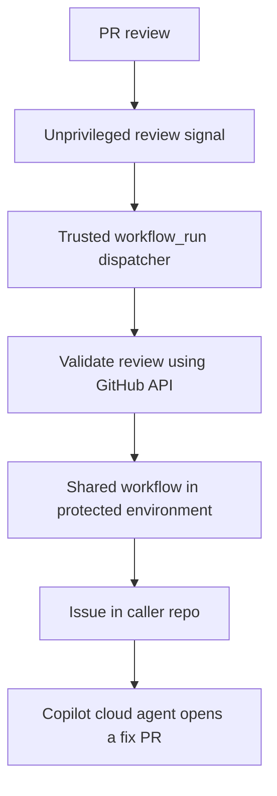

# shared-copilot-orchestrator

[](https://github.com/DownAtTheBottomOfTheMoleHole)
[](https://github.com/DownAtTheBottomOfTheMoleHole/shared-copilot-orchestrator/actions/workflows/quality.yml)
[](https://github.com/DownAtTheBottomOfTheMoleHole/shared-copilot-orchestrator/actions/workflows/release.yml)
[](https://github.com/DownAtTheBottomOfTheMoleHole/shared-copilot-orchestrator/releases)
[](./LICENSE)
[](https://github.com/features/copilot)
[](./.github/SECURITY.md)

Enterprise reusable GitHub Actions workflow for converting Copilot code review findings into actionable issues in the source repository and triggering a Copilot coding handoff.

## Architecture



## What this workflow does

- Accepts PR metadata and review payload via `workflow_call`.
- Uses inline comments from a submitted review as findings; Copilot's overview
  text is not treated as a finding.
- Sanitizes untrusted review text with `scripts/parse-review.js`.
- Creates a GitHub Issue in the caller repository only when actionable findings
  exist. An identical set of findings on the same PR commit reuses an existing
  issue on a best-effort basis: the workflow reads the newest 100 issues directly
  and uses GitHub search for older issues, whose indexing may lag.
- Assigns a new or reused issue to Copilot when actionable findings are parsed
  and the issue is open with Copilot not already an assignee. A transient
  assignment failure can therefore be retried without creating another issue;
  closed matches are left closed. Set `assign_copilot: false` to create the
  issue only.
- Runs the parser from the same commit as the called workflow version, with explicit least-privilege permissions.

## Releases

Releases are versioned with GitVersion and published automatically when changes reach `main`. The release workflow runs the tests, calculates the version from [`GitVersion.yml`](GitVersion.yml), and creates a `vMAJOR.MINOR.PATCH` tag with notes generated from [`.github/release.yml`](.github/release.yml). It refuses to publish a version older than the latest tag. Conventional commit messages drive the increment:

| Commit | Release |
| --- | --- |
| `type!:` or a `BREAKING CHANGE:` footer | major |
| `feat` | minor |
| `fix`, `perf`, `security` | patch |
| `docs`, `style`, `test`, `build`, `ci`, `chore`, `refactor`, `revert` without a breaking footer | none |

A merge that contains only non-releasing commits does not publish a new release. See [CONTRIBUTING.md](CONTRIBUTING.md#versioning-fallbacks) for the version fallbacks and manual overrides.

## Development

Run the parser tests locally with Node.js 22 or newer (CI uses Node.js 24):

```sh
node --test tests/*.test.js
```

Pull requests are checked for Conventional Commit subjects and linted with MegaLinter (actionlint, ESLint, markdownlint and yamllint). Keep commits atomic: each commit should represent one focused, independently understandable change. CI checks conventional formatting; reviewers assess whether commits are atomic. See [CONTRIBUTING.md](CONTRIBUTING.md) for the contribution and release conventions.

## Caller setup

A [`pull_request_review` workflow](https://docs.github.com/en/actions/reference/workflows-and-actions/events-that-trigger-workflows#pull_request_review) runs from the PR merge ref. For a same-repository PR, its proposed workflow changes can run when a review is submitted. Do not pass a personal access token to that workflow, including through a direct reusable-workflow call.

Use two caller workflows:

1. **Review signal:** On `pull_request_review: submitted`, run with `permissions: {}`, no secrets and no checkout. Upload an artifact named `copilot-review-signal` containing only plain numeric `review-id` and `pr-number` files. This artifact is untrusted data.
2. **Trusted handoff:** On [`workflow_run` completion](https://docs.github.com/en/actions/reference/workflows-and-actions/events-that-trigger-workflows#workflow_run) of the signal workflow, run from the default branch. Fetch the artifact from that exact run and validate its size and numeric fields. Use the read-only `GITHUB_TOKEN` to fetch the PR and review from GitHub's API. Confirm the Copilot reviewer identity, PR and review linkage, same-repository head, run identity and timing. Derive `target_sha` from the API review's `commit_id`, then call this reusable workflow in a separate job. Pass a minimal review payload containing the validated review ID; the reusable workflow fetches inline comments itself. Do not check out or execute PR code or artifact content in the privileged run.

The [app caller](https://github.com/DownAtTheBottomOfTheMoleHole/rachels-bakes/pull/326), [Terraform caller](https://github.com/DownAtTheBottomOfTheMoleHole/rachels-bakes-terraform/pull/68) and [brand caller](https://github.com/DownAtTheBottomOfTheMoleHole/rachels-bakes-brand/pull/4) show complete examples. Pin the reusable workflow to a reviewed release's full commit SHA for an immutable handoff.

Before enabling the handoff, create an environment named `copilot-orchestrator` in the **caller** repository. Restrict deployment branches and tags to `main` under **Selected branches and tags**, and place `COPILOT_ORCHESTRATOR_ENV_TOKEN` in that environment. GitHub can create an unrestricted environment automatically when a workflow names one that does not exist, so configure the branch restriction first. Remove any previous repository or organisation secret used for this handoff. The reusable workflow accepts the old `target_repo_token` secret parameter for caller syntax compatibility, but ignores it. Caller jobs should not pass a `secrets:` block.

### Inputs and outputs

| Name | Kind | Description |
| --- | --- | --- |
| `target_repository` | input, required | `owner/repo` for the issue; must equal the caller repository. |
| `target_pr_number` | input, required | Pull request number the findings relate to. |
| `target_sha` | input, required | Commit SHA the findings relate to. |
| `review_payload` | input, optional | JSON review payload: a review object (only its inline comments are used as findings), a findings array, or `{ "findings": [...] }`. |
| `assign_copilot` | input, optional | Assign the issue to Copilot when there are actionable findings. Defaults to `true`. |
| `target_repo_token` | secret, deprecated | Accepted for caller syntax compatibility but ignored. |
| `COPILOT_ORCHESTRATOR_ENV_TOKEN` | caller environment secret, required | Token used to read review comments and create or assign the issue (see below). |
| `issue_url` | output | URL of the created or reused issue; empty when no actionable findings were parsed. |
| `actionable_count` | output | Number of actionable findings parsed. |
| `copilot_assigned` | output | `'true'` when Copilot is assigned to the created or reused issue. |

### Token requirements

Copilot cloud agent starts work when an issue is assigned to it; mentioning `@copilot` in an issue body does not start a session. Assigning Copilot requires a **user** token. `GITHUB_TOKEN` and GitHub App installation tokens cannot assign Copilot.

- Use a fine-grained personal access token scoped to the caller repository with read and write access to **actions**, **contents**, **issues** and **pull requests** (or a classic token with `repo`).
- The token owner must have a Copilot plan with Copilot cloud agent access, and Copilot cloud agent must be enabled for the repository.
- Store it only as `COPILOT_ORCHESTRATOR_ENV_TOKEN` in the caller repository's `copilot-orchestrator` environment, restricted to `main`. Do not keep a repository or organisation copy.
- The trusted dispatcher rejects fork and Dependabot PRs before calling the reusable workflow. The shared job also refuses calls outside `workflow_run` on `main` and fails if the environment token is absent.

If assignment fails, the issue is still created, the run reports a warning and `copilot_assigned` is `'false'`. If you only need issues, set `assign_copilot: false`; the token then needs **issues: write**, **pull requests: read** and **metadata: read**.

## Security posture

- The reusable workflow requests only `contents: read` for `GITHUB_TOKEN`; review access and issue creation use the caller environment token after its branch restriction passes.
- Issues can only be created in the caller repository, even if the supplied token can reach other repositories.
- Untrusted review text is sanitised before issue rendering, and outputs use random heredoc delimiters so findings cannot inject workflow outputs.
- All actions are pinned to full commit SHAs.
- Security disclosures are handled privately per [SECURITY.md](./.github/SECURITY.md).

## License

This project is licensed under the [MIT License](./LICENSE).
