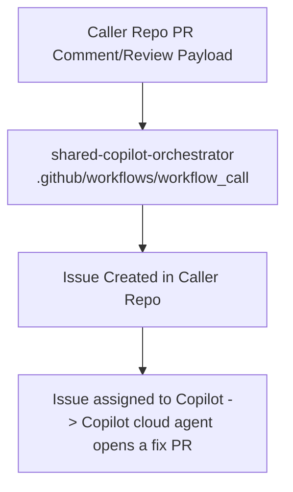

# shared-copilot-orchestrator

[](https://github.com/DownAtTheBottomOfTheMoleHole)
[](https://github.com/DownAtTheBottomOfTheMoleHole/shared-copilot-orchestrator/actions/workflows/quality.yml)
[](https://github.com/DownAtTheBottomOfTheMoleHole/shared-copilot-orchestrator/actions/workflows/release.yml)
[](https://github.com/DownAtTheBottomOfTheMoleHole/shared-copilot-orchestrator/releases)
[](./LICENSE)
[](https://github.com/features/copilot)
[](./.github/SECURITY.md)

Enterprise reusable GitHub Actions workflow for converting Copilot code review findings into actionable issues in the source repository and triggering a Copilot coding handoff.

## Architecture



## What this workflow does

- Accepts PR metadata and review payload via `workflow_call`.
- Sanitizes untrusted review text with `scripts/parse-review.js`.
- Creates a GitHub Issue in the caller repository containing the sanitised findings.
- Assigns the issue to Copilot when at least one actionable finding is parsed, which starts a Copilot cloud agent session. Set `assign_copilot: false` to create the issue only.
- Runs the parser from the same commit as the called workflow version, with explicit least-privilege permissions.

## Releases

Releases are versioned with GitVersion and published automatically when changes reach `main`. The release workflow runs the tests, calculates the version from [`GitVersion.yml`](GitVersion.yml), and creates a `vMAJOR.MINOR.PATCH` tag with notes generated from [`.github/release.yml`](.github/release.yml). It refuses to publish a version older than the latest tag. Conventional commit messages drive the increment:

| Commit | Release |
| --- | --- |
| `type!:` or a `BREAKING CHANGE:` footer | major |
| `feat` | minor |
| `fix`, `perf`, `security` | patch |
| `docs`, `style`, `test`, `build`, `ci`, `chore`, `refactor`, `revert` | none |

A merge that contains only non-releasing commits does not publish a new release. See [CONTRIBUTING.md](CONTRIBUTING.md#versioning-fallbacks) for the version fallbacks and manual overrides.

## Development

Run the parser tests locally with Node.js 22 or newer (CI uses Node.js 24):

```sh
node --test tests/*.test.js
```

Pull requests are checked for Conventional Commit subjects and linted with MegaLinter (actionlint, ESLint, markdownlint and yamllint). Keep commits atomic: each commit should represent one focused, independently understandable change. CI checks conventional formatting; reviewers assess whether commits are atomic. See [CONTRIBUTING.md](CONTRIBUTING.md) for the contribution and release conventions.

## Usage (copy/paste)

Add a workflow to the repository that should receive the issues. Pin the reusable workflow to a reviewed release tag, or to that release's full commit SHA for immutability.

```yaml
name: Copilot review handoff

on:
  pull_request_review:
    types: [submitted]

permissions:
  contents: read

jobs:
  orchestrate:
    # Example filter: only hand off reviews submitted by Copilot. Confirm the
    # reviewer login used in your repository before relying on it.
    if: github.event.review.user.login == 'copilot-pull-request-reviewer[bot]'
    uses: DownAtTheBottomOfTheMoleHole/shared-copilot-orchestrator/.github/workflows/copilot-orchestrator.yml@v1.0.1
    with:
      target_repository: ${{ github.repository }}
      target_pr_number: ${{ github.event.pull_request.number }}
      target_sha: ${{ github.event.pull_request.head.sha }}
      review_payload: ${{ toJson(github.event.review) }}
      assign_copilot: true
    secrets:
      target_repo_token: ${{ secrets.COPILOT_ORCHESTRATOR_TOKEN }}
```

### Inputs and outputs

| Name | Kind | Description |
| --- | --- | --- |
| `target_repository` | input, required | `owner/repo` for the issue; must equal the caller repository. |
| `target_pr_number` | input, required | Pull request number the findings relate to. |
| `target_sha` | input, required | Commit SHA the findings relate to. |
| `review_payload` | input, optional | JSON review payload (a review object, a findings array, or `{ "findings": [...] }`). |
| `assign_copilot` | input, optional | Assign the issue to Copilot when there are actionable findings. Defaults to `true`. |
| `target_repo_token` | secret, required | Token used to create and assign the issue (see below). |
| `issue_url` | output | URL of the created issue. |
| `actionable_count` | output | Number of actionable findings parsed. |
| `copilot_assigned` | output | `'true'` when the issue was assigned to Copilot. |

### Token requirements

Copilot cloud agent starts work when an issue is assigned to it; mentioning `@copilot` in an issue body does not start a session. Assigning Copilot requires a **user** token. `GITHUB_TOKEN` and GitHub App installation tokens cannot assign Copilot.

- Use a fine-grained personal access token scoped to the caller repository with read and write access to **actions**, **contents**, **issues** and **pull requests** (or a classic token with `repo`).
- The token owner must have a Copilot plan with Copilot cloud agent access, and Copilot cloud agent must be enabled for the repository.
- Store it as a repository or organisation secret, for example `COPILOT_ORCHESTRATOR_TOKEN`.
- Secrets are not available to `pull_request_review` runs from forks, so the handoff only runs for same-repository pull requests.

If assignment fails, the issue is still created, the run reports a warning and `copilot_assigned` is `'false'`. If you only need issues, set `assign_copilot: false`; the token then needs only **issues: write** and **metadata: read**.

## Security posture

- The reusable workflow requests only `contents: read` for `GITHUB_TOKEN`; issue creation uses the caller-supplied token.
- Issues can only be created in the caller repository, even if the supplied token can reach other repositories.
- Untrusted review text is sanitised before issue rendering, and outputs use random heredoc delimiters so findings cannot inject workflow outputs.
- All actions are pinned to full commit SHAs.
- Security disclosures are handled privately per [SECURITY.md](./.github/SECURITY.md).

## License

This project is licensed under the [MIT License](./LICENSE).
